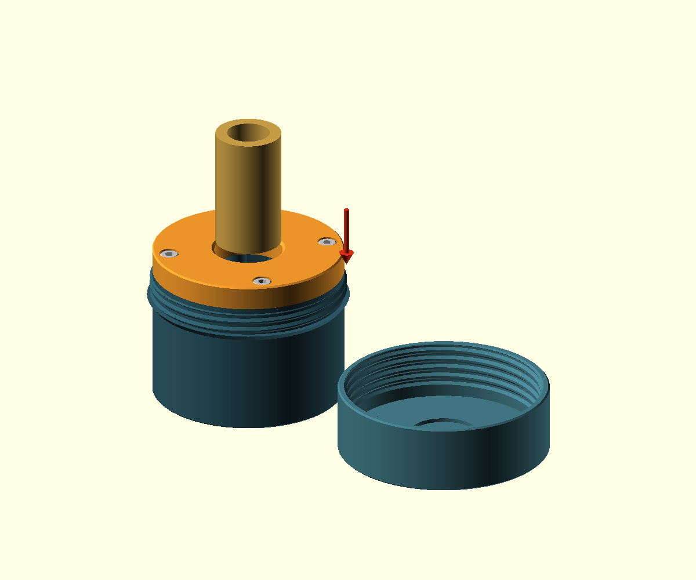

# Cane splitter — single-file OpenSCAD model

[中文打印与装配说明](README_CN.md)

All active CAD is in **`cane-splitter.scad`**, with BOSL2 `std.scad` and `screws.scad` for real M4 screw threads, as used by the neighboring reed-guillotine. Install BOSL2 in the OpenSCAD library path. Use the Manifold geometry backend. Select `oboe` for three ways or `bassoon` for four. Three main PETG parts: blade grip, stud-located guide lid with recessed M4 screws, and a threaded protective cap/palm pad.



Cane enters **from the top and moves downward**. The orange-red bevel is the cutting edge; the back extends outward/downward. The earlier incline was reversed and presented a blunt short end to top-down feed. This revision corrects that geometry.

Each complete blade is clamped by one **M2.5 ×10 screw through its round-bottom side notch**, plus washer and captured nut. The slot supports the sides; the screw clamps the printed cheeks and provides positive metal retention. The orange guide lid uses M4 ×12 socket-head screws directly in modeled M4 ×0.7 blind threads. No lid nuts or washers. Three sets per oboe unit; four per bassoon. No blade cutting, drilling or custom metal.

The Ø4.4 mm central guide is 12.3 mm high for oboe and 16.2 mm for bassoon, projecting 6 mm above the fin roots, with a 0.6 mm rounded top edge. One hub/spoke footprint is merged and given 0.8 mm concave root fillets; the rectangular spoke ends are buried at the axis. This gives continuous bottom transitions without exposed square root corners. See the [bottom view](docs/images/oboe/body_bottom.png) and [root detail](docs/images/oboe/root_detail.png). The orange lid guides the cane outside diameter.

Blade clamp holes now lie in straight 8 mm-thick outer support webs, continuous from the bed to the top, instead of raised cylindrical ears. The 3.2 mm central fins and cane exits remain clear. This removes the unsupported local clamping projections when printing upright.

A 0.6 mm ×45° chamfer runs around the orange lid upper edge, body bottom edge and both outer edges of the threaded palm cap. Set `cfg_edge_chamfer` or `--edge-chamfer`; `edge_chamfer_max` derives the limit from the actual counterbore clearance, body wall and cap opening wall, retaining a 0.4 mm lid lip and 1.2 mm shell wall. The current calculated limit is about 1.2 mm. The lid underside retains its flat body seating face.

The orange lid locates on coaxial hollow round studs, Ø7 ×2.5 mm, with 0.4 mm tip chamfers. Bottom sockets are Ø7.3 ×2.8 mm. Its 9 mm thickness leaves a 1.9 mm floor between these sockets and Ø7.6 ×4.3 mm head counterbores. M4 socket heads sit 0.3 mm below the top. Nominal screw engagement is 9.8 mm with 2.2 mm tip clearance. The screw mounts have one D-shaped footprint: a rounded inner end and a 9 mm-wide rectangular wall embedded in the body shell, extruded from the bed to the top. `ring_bolt_r` currently equals `body_r-6`; moving the screw inward automatically lengthens that wall while updating all matching stud and lid holes. See the [inward-position example](docs/images/oboe/ring_mount_inward.png), using body_r −10 and a 1.0 mm chamfer. The optional `connection_coupon` checks the actual PETG/M4 fit. Default BOSL2 internal tolerance is 8G with `$slop=0.04` (0.16 mm added diameter).

The protective cap uses a single-start right-hand trapezoidal thread, pitch 3.6 mm, depth 1 mm and approximately 2.2 engaged turns. An integral annular shoulder stops the cap before it can load the internal screw heads. No snap clips or friction pads. Default radial/axial fit allowances are 0.30/0.15 mm.

- Oboe body including shoulder: Ø63.1 ×50.4 mm including locating studs; stored: Ø66.7 ×62.9 mm. Default OD10, range 9.5–11.5 mm.
- Bassoon body including shoulder: Ø76.9 ×52.6 mm including locating studs; stored: Ø80.5 ×65.1 mm. Default OD25, range 23–27 mm.
- All print parts fit a 180 mm printer. Start with knot-free tubes at least 80 mm long and an inner bore of at least 5.5 mm. Start the splits with the palm pad, then draw the emerging strips evenly from below; short cane can be started and finished along the grain by hand.

Blade dimensions follow the current neighboring `reed-guillotine`: 39 ×19.4 ×0.23 mm, notch width 3/depth 3.8/edge distance 9.6 mm, backing width 7 and total thickness **0.53 mm** (0.23 +0.30). Actual marketplace blades can differ. Measure before printing; the fit coupon checks face and backing slots. For example, [Excel #9](https://excelblades.com/products/9-single-edge-razor-blades) lists a different .040″ backing.

Print body upright, guide flat, cap palm face down/open side up. Suggested PETG starting settings: 0.4 mm nozzle, 0.15 mm body layers for M4 threads, 0.20 mm for other parts, 5 walls, 5 top/bottom layers, 40–50% infill. Inspect grooves, small nut-pocket bridges and threads in the slicer. Install and tighten notch clamps before the guide ring. Tune thread clearance rather than forcing a tight cap.

```sh
python3 render.py oboe
python3 render.py oboe --parts connection_coupon
python3 render.py bassoon
python3 render.py bassoon --cane-diameter 27 --parts locking_ring,palm_cap
python3 render.py bassoon --preview operation --output docs/images/bassoon
python3 scripts/check_meshes.py 3D_files/oboe 3D_files/bassoon
python3 scripts/check_model.py
python3 scripts/check_backends.py
```

Print STLs are under `3D_files/oboe/` and `3D_files/bassoon/`. Legacy `obeh`/`bsn` command aliases use the same single source. Export defaults to Manifold and rejects errors/warnings; pass `--backend CGAL` for CGAL or older releases without Manifold support. Assemblies contain reference metal and are not printable parts. Thread face winding, coplanar body tops and coincident slot ends have been corrected. Delivered meshes and previews now use Manifold. Circular features use the current source settings: `$fa=1`, `$fs=0.1`, `$fn=0`; fixed-segment quality overrides have been removed. Manual cap helices follow the same resolution. Both instruments pass strict mesh and assembly checks at this resolution, including locating studs, real M4 thread motion and head counterbore clearance. `check_backends.py --compare-cgal` optionally compares CGAL, which can be slow at this resolution. The detached cap is shown open-side up to expose its thread.

All printed meshes are checked for oriented manifold edges, non-degenerate triangles, positive volume and connected solids. Model checks cover notch retention, hardware solids, cap unscrewing, ideal exit clearance and first top-down contact on the bevel. Actual splitting force, grain tracking, clamp creep and thread life remain untested. See [design notes](docs/design.md) and the validation reports.
