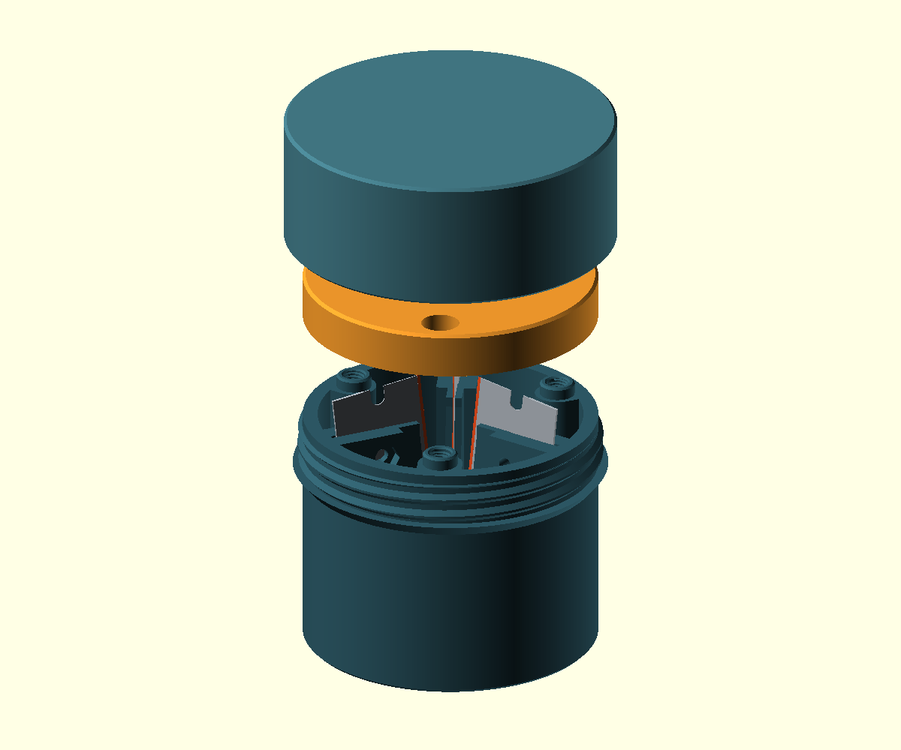

# 芦苇管三分／四分器

所有产品建模代码均在 **`cane-splitter.scad` 一个文件中**。M4 标准螺纹使用 BOSL2 的 `screw_hole()`／`screw()`，与相邻 `reed-guillotine` 一致；需安装 BOSL2，但不需要产品自身的 `libs/` 分类。选择 `oboe` 为三分、`bassoon` 为四分。

三个主要 PETG 打印件：握持刀座、带圆榫定位及 M4 沉孔的橙色导向盖、带内螺纹的保护／掌压盖。保护盖通过粗牙螺纹旋在刀座上，不使用卡扣或摩擦保持筋。

橙色导向盖上沿、主体底沿及螺纹掌压盖两端外沿均有 **0.6 mm ×45° 倒角**，柔化手部接触边缘，并给主体和掌压盖的打印首层留出象脚补偿空间。可用 `cfg_edge_chamfer` 或导出选项 `--edge-chamfer` 调整。上限由 `edge_chamfer_max` 按沉孔位置、主体壁厚和掌压盖开口壁厚计算，保留 0.4 mm 盖上沿及 1.2 mm 主体／掌压盖壁厚；当前尺寸的上限约为 1.2 mm，不再固定为 0.6 mm。导向盖下侧仍以完整平面贴合主体。


## 刃口与进料方向

**芦苇从上方导向孔进入，向下推进。** 橙红色的细带表示真实建模的开刃区域；刀背在外侧、下方。现在是刃口先接触芦苇，随后刀座筋条沿裂缝撑开各片。底部出口供苇片穿出。

中心导向柱直径 4.4 mm，双簧管高约 12.3 mm、巴松高约 16.2 mm，比筋条根部高 6 mm，顶部圆角 0.6 mm。柱根与三／四条筋的平面轮廓先合并，再用 0.8 mm 内凹圆角连接，矩形筋端埋入中心，不再露出方角或短端面。底部轮廓连续，筋条由打印底面向上成型，进料仍由橙色盖定位芦苇外径。 [底部正视图](docs/images/oboe/body_bottom.png) · [柱根局部图](docs/images/oboe/root_detail.png)。

上一版刀片倾斜方向反了，从上方会先遇到未开刃的短端面；这一点已经纠正。当前模型具有真实厚度的刀身、刀背、斜刃和两端圆底缺口。刃口颜色只是装配图标识，不会出现在打印 STL 中。

## 刀片固定

每片刀使用一颗 **M2.5 ×10 mm 横向螺丝**、平垫圈及六角螺母。螺丝穿过刀片外端的圆底侧缺口，拧紧时夹住刀座两侧；金属螺杆还为刀片提供机械止挡。槽负责侧向支撑，缺口螺丝负责夹紧和止退。刀片不再仅靠插槽和顶圈限制位置。

刀片夹紧螺孔已改为支撑筋外段的平直厚壁，厚度 8 mm，从刀座底面连续到顶面；螺孔处没有单独凸出的圆柱耳座。中心切分段仍为 3.2 mm 薄筋，厚壁内缘位于苇片出口之外，便于竖直打印。

刀片竖直插入，不必切短、磨削或钻孔。夹紧螺丝在导向圈安装前拧紧。螺母装入刀座内部的六角袋，从上方用小号内六角扳手操作。

刀片参数按当前相邻 `reed-guillotine` 仓库复用：

- 刀长 39 mm、刀宽 19.4 mm、刀身厚 0.23 mm。
- 缺口宽 3 mm、深 3.8 mm、中心距刃口 9.6 mm；缺口是圆底形状，螺丝轴位于圆底中心。
- 背脊宽 7 mm、总厚 **0.53 mm**。这个总厚由该仓库的 `blade_thickness + back_clamp_thickness` 得到，即 0.23 +0.30 mm。

这些是项目里的刀片参数，并不代表所有标有 009RD 的品牌外形完全一样。购买后确认实际刀片，特别是缺口和刀背；例如 [Excel #9](https://excelblades.com/products/9-single-edge-razor-blades) 的厂商说明给出 .040″ 背脊，与本项目默认值不同。不同刀片应修改参数并重新导出。

## 橙色导向盖：圆榫、M4 螺纹及沉孔

每个固定点有一个与螺丝共轴的中空圆榫，形式参考 `reed-guillotine` 的积木式圆榫。圆榫外径 **7 mm**、突出高度 **2.5 mm**，顶部有 0.4 mm 导入倒角；橙色盖下侧的榫孔直径 7.3 mm、深度 2.8 mm。先将三／四个榫头落入对应孔中，再拧螺丝，圆榫负责定位和限制盖的横向移动。

主体螺孔座采用“内端半圆＋矩形连接墙”的完整 D 形截面，宽 9 mm，从底面一直打印到主体顶面，外端伸入侧壁中部。`ring_bolt_r` 同步控制螺孔、圆榫、盖通孔和沉孔半径，当前为 `body_r-6`；调小半径时连接墙自动增长，固定座仍与侧壁相连。固定座内端须在苇片出口之外；调节后重新导出主体和橙色盖。 [向内调整示例](docs/images/oboe/ring_mount_inward.png)（螺孔半径 `body_r-10`、倒角 1.0 mm）。

使用 **M4 ×12 mm 内六角圆柱头螺丝（ISO 4762，粗牙螺距 0.7 mm）**，直接旋入主体和圆榫中心的实际内螺纹，不再使用导向盖螺母或垫圈。主体螺孔按 BOSL2 `8G` 内螺纹生成，默认 `$slop=0.04`，可用 `cfg_m4_thread_slop` 校准打印配合；该补偿量使孔径增加 0.16 mm。盲孔从圆榫顶部向下 12 mm，螺丝装好后的名义旋合长度约 9.8 mm，尖端仍有约 2.2 mm 余量。

橙色盖厚 **9 mm**。上侧螺丝头沉孔直径 **7.6 mm**、深度 **4.3 mm**，容纳约 Ø7 ×4 mm 的 M4 圆柱头，头部低于盖表面 0.3 mm。沉孔底与下侧榫孔之间保留 **1.9 mm** 厚度；中央过孔 Ø4.4 mm。保护／掌压盖也已调整内部高度，给导向盖及定位杯留出间隙。

先打印可选的 `connection_coupon.stl`，它包含一对小型圆榫／榫孔和相同的 M4 螺纹、沉孔。用计划购买的 M4 ×12 螺丝空试，再打印主体；不要靠强拧修正配合。改变榫头或 M4 公差时，需重新生成主体、橙色盖和连接试片。

## 螺纹盖

单头右旋粗牙梯形螺纹，螺距 **3.6 mm**、牙深 **1.0 mm**，两端有导入段。主体螺纹有效高度 8 mm，约 2.2 圈。盖内的径向／轴向间隙分别为 0.30／0.15 mm，可按打印机调整。

收纳时沿右旋方向轻拧保护盖，拧至外部肩面止挡即可；盖沿停在肩面上，内部仍留有螺丝头间隙。使用时旋下，内侧浅杯抵住芦苇另一端，平整外面承受掌压。盖内螺纹按实际装配坐标生成，再翻转成打印方向，因此与主体螺纹匹配。

## 尺寸与标准件

- 双簧管三分：含螺纹及止挡肩的刀座约 **Ø63.1 ×50.4 mm（包含定位榫）**，收纳约 **Ø66.7 ×62.9 mm**；默认 10 mm 外径，支持 9.5–11.5 mm。
- 巴松四分：含螺纹及止挡肩的刀座约 **Ø76.9 ×52.6 mm（包含定位榫）**，收纳约 **Ø80.5 ×65.1 mm**；默认 25 mm 外径，支持 23–27 mm。
- 内孔建议至少 5.5 mm，中心支撑为 Ø4.4 mm。导向圈应按实际外径调整，整管可以轻松通过。
- 三个主要件都适合 180 ×180 ×180 mm 打印机。管长不决定工具长度；初次试用建议至少 80 mm、无节的管料，以便从下方握住苇片。短管可先起裂，取出后沿纤维分开。

双簧管需要下列标准件各 3 个，巴松各 4 个：

- 完整的带背脊、带圆底侧缺口 .009／009RD 单面刀片。
- 刀片夹紧：M2.5 ×10 mm 内六角圆柱头螺丝（ISO 4762）、M2.5 普通六角螺母（通常对边 5 mm、厚 2 mm）、M2.5 平垫圈（外径 6 mm、厚 0.5 mm）。
- 橙色导向盖固定：M4 ×12 mm 内六角圆柱头螺丝（ISO 4762），不另配螺母或垫圈。

M2.5 用于匹配 3 mm 刀片缺口；M4 螺丝固定橙色导向盖，主体内螺纹为直接打印的 PETG 螺纹。无需定制金属、热熔螺母、轴承、推杆或敲击装置。

## 打印与装配

1. 先打印 `coupon.stl`，三个试块对应默认刀身／刀背间隙减 0.06、默认、加 0.06 mm。刀片应能轻插、晃动小。用刀背操作，勿强压刀刃。
2. 刀座底朝下，导向圈平放，保护盖掌面朝下、开口朝上。STL 已按此方向导出。PETG、0.4 mm 喷嘴、主体的 M4 螺纹建议使用 0.15 mm 层高，其他件可用 0.20 mm；建议 5 圈外墙、5 层顶底、40–50% 填充。刀槽、螺母袋和内外螺纹须在切片预览中保持清楚。
3. 刀座正常方向不需要支撑；M2.5 螺母袋有短桥接，横向夹紧孔是小直径桥接。橙色盖榫孔上方的承压层有约 1.45 mm 的短桥接。不要让支撑填入刀槽和螺纹。保护盖的内定位杯从实心掌面上直接向上打印。
4. 导向圈未装时，先装横向 M2.5 螺母，竖直插入刀片，穿入 M2.5 螺丝与垫圈，交替轻拧夹紧。确认螺杆位于缺口中，刀片没有明显松动；不用拧到 PETG 变形。
5. 将橙色盖的下侧榫孔对准主体圆榫，轻放到底，再从沉孔穿入 M4 ×12 螺丝，交替轻拧。最后空试螺纹保护盖。过紧时调大螺纹间隙重新打印，不通过大力旋入校准。
6. 用掌压盖均匀推苇，苇片从底部露出后，握住足够长的露出段均匀拉出。掌压盖到达工具顶部时停止推进；它不进入刀组。短管先起裂再手动完成。
7. 卡住、弯曲或裂线偏移时停止检查，不用锤补力；手指留在外壁和出口外。清理碎屑、擦干金属，再旋上保护盖。



## 打开、导出与检查

直接打开 `cane-splitter.scad`，选择 **Manifold 几何后端**，在 Customizer 选乐器、零件、装配／爆炸／剖面／进料示意。`render.py` 只是可选的批量导出工具，模型本身可以独立使用。

```sh
python3 render.py oboe
python3 render.py oboe --parts connection_coupon
python3 render.py bassoon
python3 render.py bassoon --cane-diameter 27 --parts locking_ring,palm_cap
python3 render.py oboe --notch-width 3 --notch-depth 3.8 --notch-from-edge 9.6
python3 render.py bassoon --preview operation --output docs/images/bassoon
python3 scripts/check_meshes.py 3D_files/oboe 3D_files/bassoon
python3 scripts/check_model.py
python3 scripts/check_backends.py
```

`render.py` 默认使用 Manifold，也可加 `--backend CGAL` 切换。圆形特征使用文件顶部的统一设置，当前为 `$fa=1`、`$fs=0.1`、`$fn=0`，不再使用固定分段数或 `--quality` 覆盖精度。手工生成的大螺纹也按同一精度计算分段。若安装的是仅支持 CGAL 的旧版 OpenSCAD，需要显式使用该选项。

每种乐器生成三个主要打印 STL 和一个试片文件。`obeh`／`bsn` 旧命令仍可用，但都调用同一个 SCAD 文件。改变芦苇外径只需重打导向圈和盖；改变刀片或缺口尺寸需重新生成整套。

打印件逐一检查了非退化三角面、每条边的闭合与方向、单一连通实体、正体积和打印尺寸；还检查刀片与紧固件实体、缺口止挡、装刀路径、螺纹旋开、出口及顶部向下的首次切割接触。模型预览先生成完整零件，避免未完成布尔运算产生虚面。检查报告在 `docs/`。现已修正螺纹网格的面方向、刀座顶面及刀槽端面的共面接缝，交付 STL 和预览均使用 Manifold。两种规格均在当前圆弧精度下通过实体网格检查，并检查了定位圆榫、M4 内外螺纹旋合和螺钉头沉孔；刀片夹紧厚壁还检查了底面至螺孔下方的连续支撑。快速预览的显示效果不能代替实体检查。右侧分离的保护盖开口朝上，以便显示内螺纹，收纳时应翻转。

**实物起裂力、PETG 长期夹持和螺纹寿命尚未验证。** 先打印配合试片、组装检查，再用废料逐步试用；数字检查不保证自然芦苇的裂线或实际受力。详见 [设计说明](docs/design.md)。
